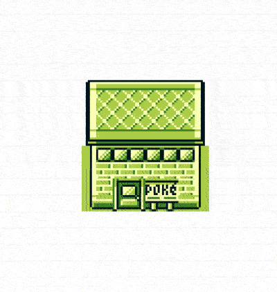

# Procedural Pokémon Buildings

Procedurally generate Pokémon buildings based on rough rules influenced by the buildings from generation one (Red/Blue/Green/Yellow).

## Introduction
After completing my [National Dex project](https://www.nikouusitalo.com/blog/making-a-living-dex-part-1-a-lifelong-dream/) I wanted to keep up a big Pokémon binge but I also wanted to time to do the following:
1. Catch up with any stray features from recent ECMAScript versions
2. Create something vanilla with no faff
3. Learn to use the HTML canvas properly*

**It turns out the low level API the canvas provides isn't fun to work with and as such I picked up [Fabric.js](http://fabricjs.com/).
For spending less time writing CSS I also opted for [FlexBoxGrid](http://flexboxgrid.com/).
Note: This has only been tested in Chrome*

## Features
- Resize your building and have it generated on the fly
- Drag the building around
- Drag the canvas around
- Change the features on the building (cladding, roof, doors or not, etc)
- Save/paste your building via the building code
- Generate a random building

## Live Demo
https://nikouu.github.io/procedural-pokemon-buildings/

## To do list
https://github.com/nikouu/procedural-pokemon-buildings/projects/1
